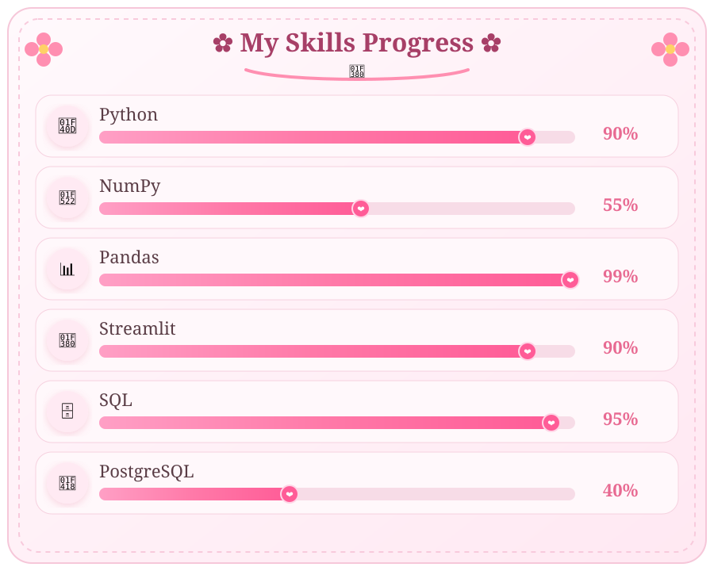

<p align="center">
  
</p>

<p align="center">
  
</p>

<h1 align="center">✿ Welcome to my GitHub Garden ✿</h1>

<p align="center">
  Learning • Growing • Creating
</p>

<p align="center">
  
</p>

---

<p align="center">
  
</p>

## 🌷 About Me

```python
class Developer:

    name = "Fatima Siddiqui"

    role = "Python Developer"

    skills = [
        "Python",
        "NumPy",
        "Pandas",
        "Streamlit",
        "SQL",
        "PostgreSQL"
    ]

    motto = "Keep learning. Keep growing."
```

I'm passionate about learning new technologies, solving problems through code, and growing one step at a time. 🌸

---

<p align="center">
  
</p>

<p align="center">

# 🎀 Tech Stack 🎀

<i>The tools I enjoy working with ✿</i>

</p>

<p align="center">
  
</p>

<p align="center">
  
  
  
  
</p>

---

<p align="center">
  
</p>

<p align="center">

# 🌸 My Skills Progress 🌸

<i>Growing a little every day ♡</i>

</p>

<p align="center">
  
</p>

---

<p align="center">
  
</p>

<p align="center">

# 🌱 Currently Learning 🌱

<i>Watering my skills every day 🌷</i>

</p>

<table align="center">
<tr>
<td align="center" width="180">

### 🐍

**Python Development**

</td>

<td align="center" width="180">

### 📊

**NumPy & Pandas**

</td>

</tr>

<tr>
<td align="center">

### 🎀

**Streamlit Apps**

</td>

<td align="center">

### 🗄️

**SQL & PostgreSQL**

</td>

</tr>
</table>

---

<p align="center">
  
</p>

<p align="center">

# 💗 GitHub Garden 💗

<i>Watching my little garden bloom ✿</i>

</p>

<p align="center">
  

  
</p>

<p align="center">
  
</p>

---

<p align="center">
  
</p>

<p align="center">

# 🌼 Future Projects 🌼

<i>Seeds waiting to bloom ✨</i>

</p>

<p align="center">
  🌱 Python Projects &nbsp; • &nbsp; 📊 Data Analysis &nbsp; • &nbsp; 🎀 Streamlit Apps &nbsp; • &nbsp; 🗄️ SQL Projects
</p>

---

<p align="center">
  
</p>

<p align="center">

# 🐍 My Blooming Garden 🐍

<i>Watching my contributions bloom every day ✿</i>

</p>

<p align="center">
  
</p>

<p align="center">
  🌸 Every commit is another flower in my garden 🌸
</p>

---

<p align="center">
  
</p>

<p align="center">

# 💌 Let's Connect 💌

</p>

<p align="center">
  <a href="https://github.com/FatimaSiddiqui04">
    
  </a>

  <a href="mailto:fatimasiddiqui04">
    
  </a>
</p>

<p align="center">
  
</p>

<p align="center">
  <i>"Every line of code is a tiny bloom."</i>
</p>

<p align="center">
  ✿──────────────♡──────────────✿
</p>

<p align="center">
  Made with 🌸, Python & lots of coffee ☕
</p>
